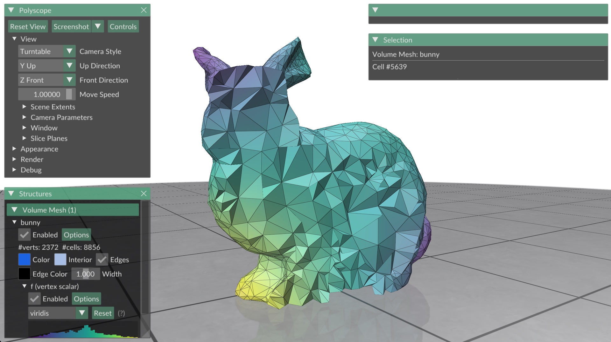

# Geometry Central Combinatorial Maps



Loads a tet mesh using an experimental geometry-central implementation of the combinatorial map data structure. See the CGAL docs for more [details on the data structure](https://doc.cgal.org/latest/Combinatorial_map/index.html). The code is still experimental and hasn't been merged into geometry-central yet, but the implementation can be found [here](https://github.com/MarkGillespie/geometry-central/tree/CombinatorialMaps/include/geometrycentral/combinatorial-maps).

To build the code, you can run
```
cd build
make -j7
```

Then run the code with
```
bin/run ../data/bunny_small.1.ele
```
